# installation Firebase

rendez-vous sur la page du projet fire base

## création du projet sur firebase

[Google Firebase](https://console.firebase.google.com/u/0/)

1. créer un projet

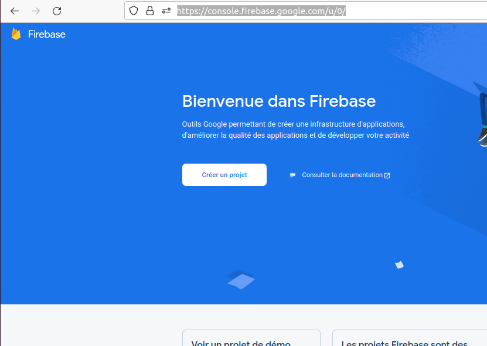

projet name

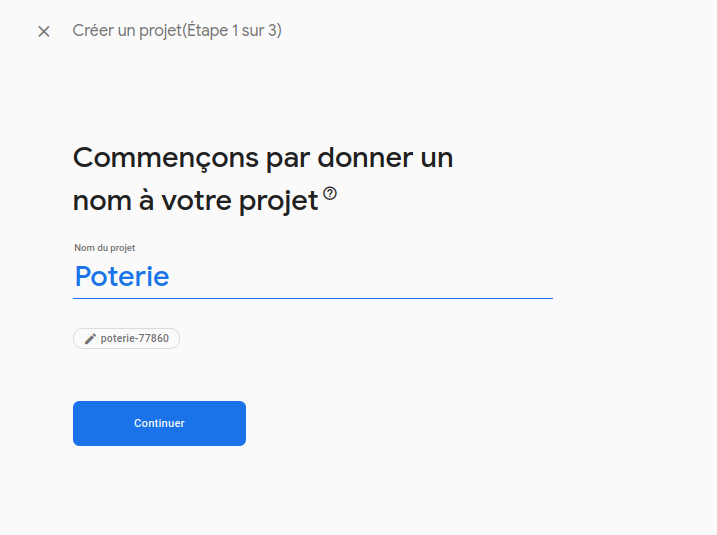

pas besoin de google analitics
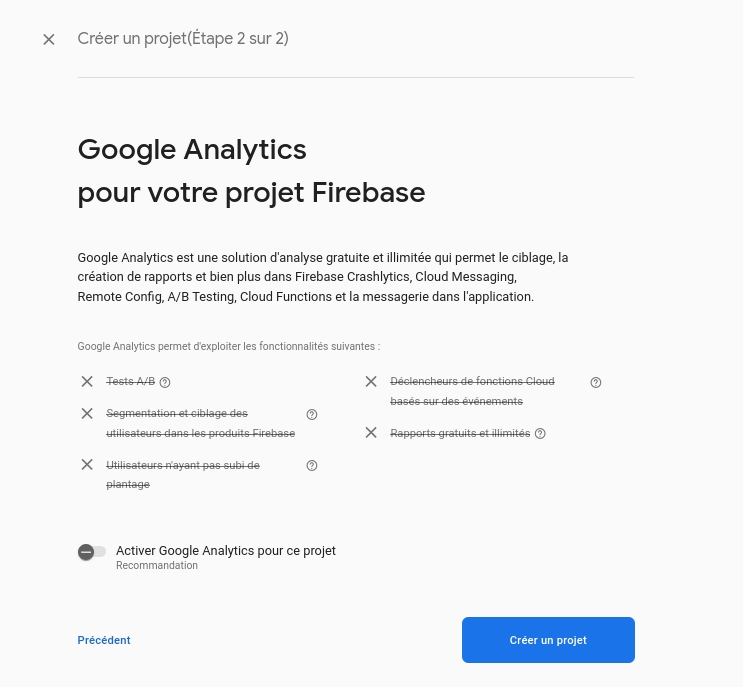

ensu
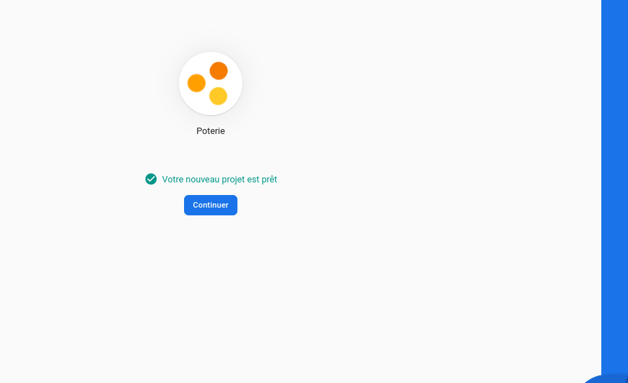

ajouter firebase à l'application :

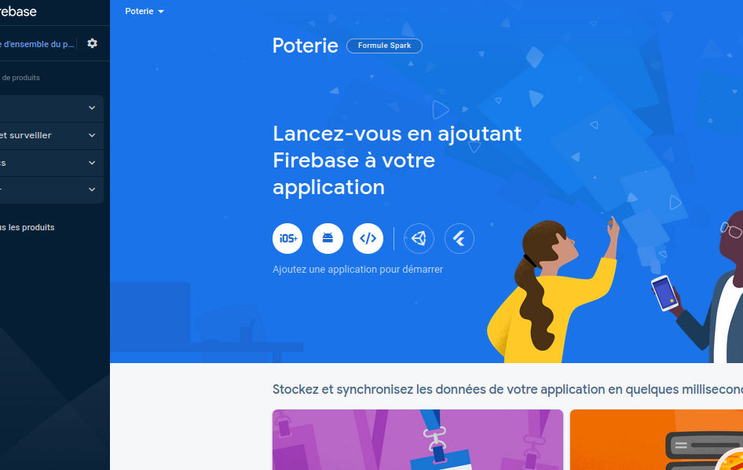

click ici : 

ensuite remplir le questionnaire

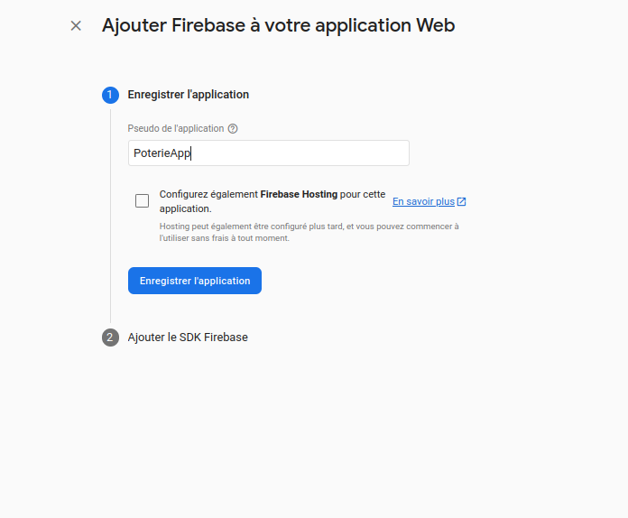
le hosting est a configuer plus tard lors de la mise en ligne

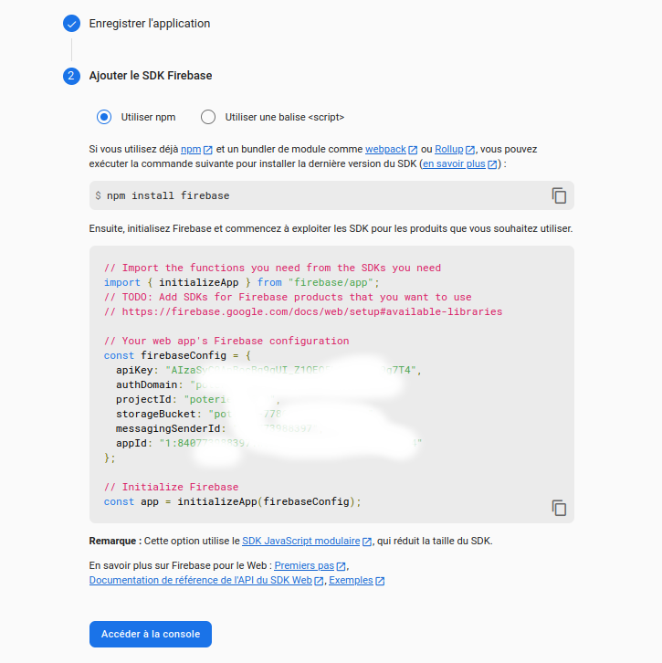

installer la bibliothèque

```sh
npm install firebase
```

copier le script JS avec les clée d'accès

```js
// Import the functions you need from the SDKs you need
import { initializeApp } from "firebase/app";
// TODO: Add SDKs for Firebase products that you want to use
// https://firebase.google.com/docs/web/setup#available-libraries

// Your web app's Firebase configuration
const firebaseConfig = {
  apiKey: "ABCDEF-1234",
  authDomain: "poterABCDEF-1234.firebaseapp.com",
  projectId: "ABCDEF-1234",
  storageBucket: "ABCDEF-1234.appspot.com",
  messagingSenderId: "8407739ABCDEF-123488397",
  appId: "1:ABCDEF-12347:web:6bcf30c9ABCDEF-1234514f16e08a4",
};

// Initialize Firebase
const app = initializeApp(firebaseConfig);
```

ensuite créer la base de donnée$

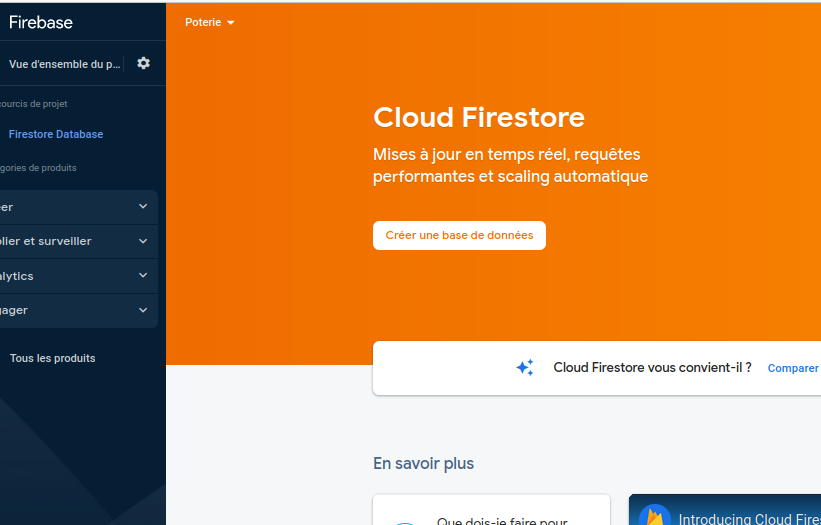

créer la base en mode test pour avoir toutes les fonctionnalités et ensuite le passer en prod en elevant les sécurités

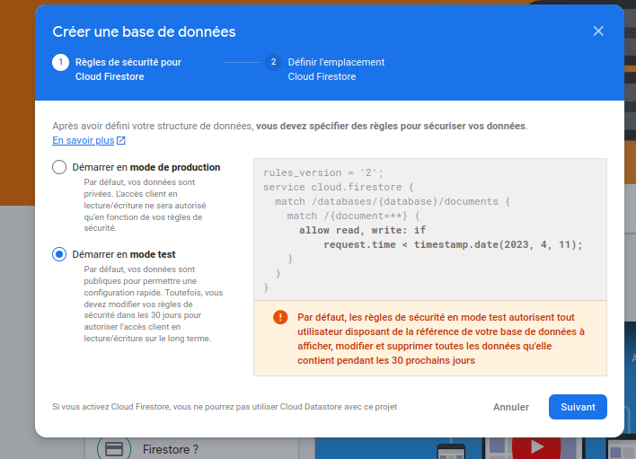

choisir la région du monde ou est stocké la base de donnée

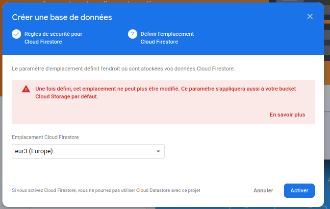

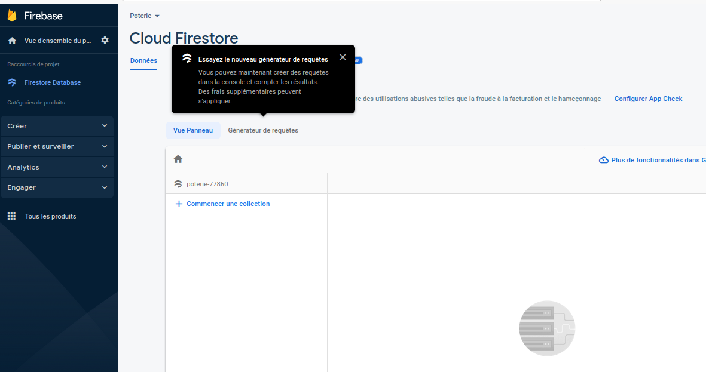

c'est terminé : le projet est accessible par la console
